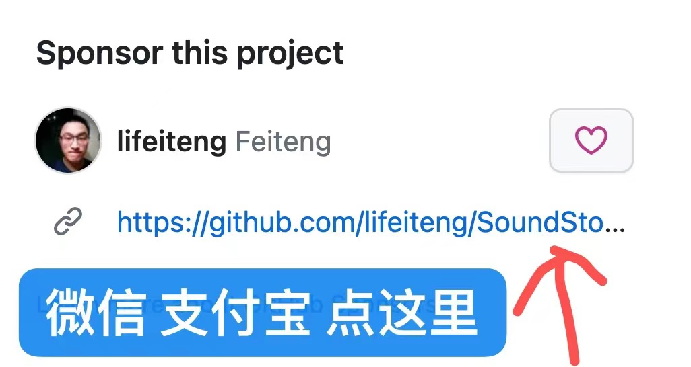

# SoundStorm: Efficient Parallel Audio Generation

# Demo Page
* [https://lifeiteng.github.io/SoundStorm/index.html](https://lifeiteng.github.io/SoundStorm/index.html)

# Objective Evaluation
* `LibriTTS test clean`
* ASR WER `whisper large-v2`
* Speaker Embedding [https://huggingface.co/docs/transformers/model_doc/wavlm#transformers.WavLMForXVector](https://huggingface.co/docs/transformers/model_doc/wavlm#transformers.WavLMForXVector)

| Prompt | WER | Speaker cosine Similarity  | UtteranceLevel Pitch Mean MAE |  UtteranceLevel Pitch Std MAE |  UtteranceLevel Duration Diff | 
| ---- | ---- | ---- | ---- | ---- | ---- | 
| Ground Truth | 0.86 | - | - | - | - |
| 2 Seconds | 2.32 | 0.8670 | 20.1407 | 17.4387 | - |
| 4 Seconds | 2.10 | 0.8817 | 21.1379 | 19.3733 | - |
| 6 Seconds | 1.95 | 0.8905 | 17.2253 | 15.3792 | - |
| 8 Seconds | 2.33 | 0.8895 | 18.5837 | 15.9667 | - |
| 4 Seconds(PrefixPrompt) | 1.83 | 0.9351 | 12.0929 | 14.3814 | `1.5564 / 12.7153` (avg utter duration）|

# Sponsor this project 赞助该项目

As an independent developer, I am not employed by any company, which means my projects are freely available and open. However, I do need to pay for GPU cloud services to acquire the computational resources required for my experiments. Therefore, I need to raise funds to sustain these operational expenses. By securing sufficient funding, sponsors will receive comprehensive technical support.

When I gather adequate funding, sponsors will receive full technical support. This means that as a sponsor, you will enjoy unique benefits and privileges, including but not limited to:

1. Priority Support: As a sponsor, your questions and needs will be prioritized and addressed promptly. I will do my best to provide personalized technical support and solutions tailored to your requirements.

2. Custom Development: As a sponsor, you can request specific features and functionalities, and I will strive to meet your personalized needs by customizing the development accordingly.

3. Early Access: As a sponsor, you will have early access to my latest projects and features, allowing you to stay informed about my latest advancements.

4. Sponsor-exclusive Perks: As a sponsor, you will have access to additional special benefits, such as participation in sponsor-exclusive discussion forums, conferences, or seminars, as well as potential collaboration opportunities.

I firmly believe that with your generous sponsorship, I will be able to continue conducting innovative research and projects while providing outstanding technical support and personalized services to my esteemed sponsors.
Thank you very much for your support!

作为一名自由独立的开发者，我并没有与任何公司签约，这意味着我的项目是自由开放的。然而，为了购买实验所需的GPU算力资源，我需要支付云服务商不菲的费用。为了确保项目的顺利运行，我需要筹集资金来支持这些开支。

当我筹集到足够的资金时，赞助者们将获得充分的技术支持。这意味着您作为赞助者将享受到独特的待遇和特权，包括但不限于：

1. 优先支持：作为赞助者，您的问题和需求将优先考虑和解决。我将尽我所能为您提供个性化的技术支持和解决方案。

2. 定制开发：作为赞助者，您可以提出特定的需求和功能要求，我将致力于满足您的个性化需求，并根据您的要求定制开发。

3. 早期访问：作为赞助者，您将优先获得我最新项目和功能的早期访问权限，您将第一时间了解到我的最新进展。

4. 赞助者专属福利：作为赞助者，您将享受到额外的特殊福利，例如赞助者专属的讨论论坛、会议或研讨会的参与权，以及可能的合作机会等。

我深信，您的慷慨赞助将使我能够继续开展创新的研究和项目，并为广大赞助者提供出色的技术支持和个性化服务。
非常感谢您对我的支持！

或者

